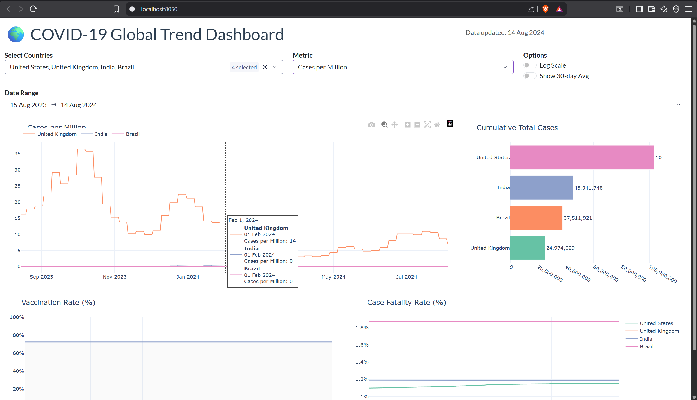

# 🌍 COVID-19 Global Trend Analysis & Interactive Dashboard

A fully interactive data dashboard built with **Plotly Dash** that visualizes COVID-19 case counts, mortality rates, and vaccination progress across 50+ countries using live WHO/OWID data with automated daily refresh.


---

## 📌 Project Overview

This project ingests live COVID-19 data from Our World in Data (OWID), applies rolling average smoothing, missing-value imputation, and case fatality rate calculations, then serves an interactive multi-panel Dash dashboard. Data is cached locally and refreshed automatically every 6 hours.

**Key Features:**
- ✅ **50+ countries** tracked with live data
- ✅ **Rolling average smoothing** (7-day and 30-day)
- ✅ **Log-scale toggling** for exponential-phase analysis
- ✅ **Country comparison overlays** — select any combination of countries
- ✅ **4 chart panels**: trends, cumulative totals, vaccination rates, case fatality rates
- ✅ Automated daily data ingestion with error handling and cache fallback

---

## 🏗️ Architecture

```
Our World in Data API (live CSV)
        │
        ▼
Data Ingestion Layer
  ├── HTTP fetch with 6-hour cache
  ├── Fallback to stale cache on network failure
  └── Missing value interpolation
        │
        ▼
Processing Layer
  ├── Rolling average smoothing (7-day, 30-day)
  ├── Case fatality rate calculation
  ├── Cases per 100k normalization
  └── Region/aggregate filtering
        │
        ▼
Plotly Dash Dashboard
  ├── Country multi-selector
  ├── Metric dropdown (6 metrics)
  ├── Date range picker
  ├── Log scale toggle
  └── 4 interactive chart panels
```

---

## 🛠️ Tech Stack

| Component | Technology |
|---|---|
| Dashboard | Plotly Dash, Dash Bootstrap Components |
| Charts | Plotly Graph Objects |
| Data Processing | Pandas, NumPy |
| Data Source | Our World in Data (OWID) |
| HTTP | Requests |
| Caching | Local CSV with TTL |

---

## 🚀 Getting Started

### 1. Clone the repo
```bash
git clone https://github.com/saibharghab/covid19-trend-dashboard.git
cd covid19-trend-dashboard
```

### 2. Install dependencies
```bash
pip install -r requirements.txt
```

### 3. Run the dashboard
```bash
python covid_dashboard.py
# Open http://localhost:8050
```

Data downloads automatically on first run (~15MB). Subsequent runs use the local cache.

### 4. Export static charts (optional)
```bash
pip install kaleido
python covid_dashboard.py --export
# Saves output/covid_dashboard.png
```

---

## 📸 Screenshot



## 📊 Dashboard Panels

| Panel | Description |
|---|---|
| **Trend Chart** | Daily metric over time for selected countries with optional 30-day moving average |
| **Bar Chart** | Cumulative totals ranked by country |
| **Vaccination Rate** | People vaccinated per 100 population over time |
| **Case Fatality Rate** | Deaths as % of confirmed cases over time |

---

## 🎛️ Dashboard Controls

| Control | Options |
|---|---|
| **Countries** | Any combination from 50+ countries |
| **Metric** | New cases, deaths, cases per million, deaths per million, vaccination rate, hospitalisations |
| **Date Range** | Adjustable date picker |
| **Log Scale** | Toggle for exponential-phase visualization |
| **30-day Avg** | Overlay a smoother trend line |

---

## 📁 Project Structure

```
covid19-trend-dashboard/
├── covid_dashboard.py       # Full pipeline + Dash app
├── requirements.txt
├── .gitignore
├── cache/
│   └── covid_data.csv       # Auto-generated local cache
└── output/
    └── covid_dashboard.png  # Static export
```

---

## 🔄 Data Refresh

The dashboard automatically refreshes data every **6 hours**. To force a refresh:

```python
# In covid_dashboard.py, call:
fetch_data(force_refresh=True)
```

Or simply delete `cache/covid_data.csv` and restart.

---

## 📡 Data Source

- **Our World in Data (OWID)** — aggregated from Johns Hopkins University, WHO, and national health ministries
- Dataset is updated daily and is **public domain**
- Full data dictionary: [github.com/owid/covid-19-data](https://github.com/owid/covid-19-data)

---

## 💡 Technical Highlights

- **Cache-first architecture** — dashboard loads instantly even without network access
- **Graceful degradation** — falls back to stale cache if download fails, never crashes
- **Rolling smoothing** — 7-day averages applied client-side where OWID pre-smoothed data is unavailable
- **Region exclusion** — automatically filters out aggregate rows (e.g. "World", "Europe") so only country-level data is shown

---

## 📄 License

MIT License — free to use, modify, and distribute.

---

## 👤 Author

**Sai Bharghava Kumar Yidupuganti**  
[LinkedIn](https://www.linkedin.com/in/yidupuganti-sai-bharghava-kumar-b41388221/) · [GitHub](https://github.com/saibharghab)
